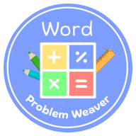

# Word Problem Weaver

**Word Problem Weaver** is an offline-ready Progressive Web App (PWA) designed to help teachers generate customizable math problem sets. It uses [Google Chrome's Built-in AI](https://developer.chrome.com/docs/ai/built-in-apis) to create word problems and level-appropriate hints, making it a valuable tool for classrooms practicing mathematics and that may have unreliable internet. One of the biggest classroom challenges I have learned from volunteering in schools is what to do if the internet goes down or is running too slow and all of your assignments are conducted through apps and websites. This app was designed to provide a high-quality AI experience, accelerate assignment creation, and also work entirely offline if needed. This app allows students to access assignments either by scanning QR codes or by entering a custom link produced when the assignment is created.

Learning never stops because of bad internet when you use [Word Problem Weaver](https://www.wordproblemweaver.com)!

## Features

- Generate customizable math problem sets.
- AI-generated word problems and level-appropriate hints using Chrome's Built-in AI
- Offline-ready functionality using PWA technology.
- QR code and links for easy sharing and access to assignments.

## Technologies Used

- **AI on Chrome**: Leverages [Chrome's Built-in AI](https://developer.chrome.com/docs/ai/built-in-apis), specifically the [Writer API](https://developer.chrome.com/docs/ai/built-in-apis#writer_and_rewriter_apis) to generate word problems and hints for students 
- **Vue 3**: [Frontend framework for building the user interface](https://vuejs.org/).
- **BalmUI**: [Material Design UI components library for Vue](https://material.balmjs.com/).
- **Vite**: [Build tool for fast development and bundling](https://vite.dev/).

## Getting Started

### Prerequisites

Make sure you have **Node.js** installed. You can download it from [nodejs.org](https://nodejs.org/).

### Installation

1. Clone this repository:

   ```bash
   git clone https://github.com/kevinl95/wordproblemweaver.git
   cd wordproblemweaver
   ```
2. Install dependencies:
   ```bash
   npm install
   ```

### Development

To run the project locally in development mode, use:
```bash
npm run dev
```
This will start a local development server and open the app in your browser at a localhost address printed to the console. Any changes you make to the code will automatically reload the page.

### Building for Production

To build the app for production, use:

```bash
npm run build
```

This will generate optimized static files in the dist/ directory.

### Preview Production Build

To preview the production build locally, run:

```bash
npm run preview
```

### Generate PWA Assets

To regenerate PWA assets (e.g., icons and splash screens), run:

```bash
npm run generate-pwa-assets
```

## AI Content Disclosure

The content displayed in this app includes AI-generated graphics and text. The role of AI in creating these visuals and content has been clearly disclosed to ensure transparency and clarity for users.

## About the Graphics

The student and teacher illustrations used in this app were created with the help of [Canva's](https://www.canva.com) AI tools. All AI-generated content has been reviewed and refined to ensure quality and relevance to the project.

### Attribution:
Graphics in this application were generated with the assistance of [Canva's](https://www.canva.com) AI tools and are used with permission.

### Acceptable Use:
The AI-generated graphics comply with [Canva's Acceptable Use Policy](https://www.canva.com/policies/acceptable-use-policy/), and care has been taken to ensure that no content shared or displayed violates these terms or may offend others.
